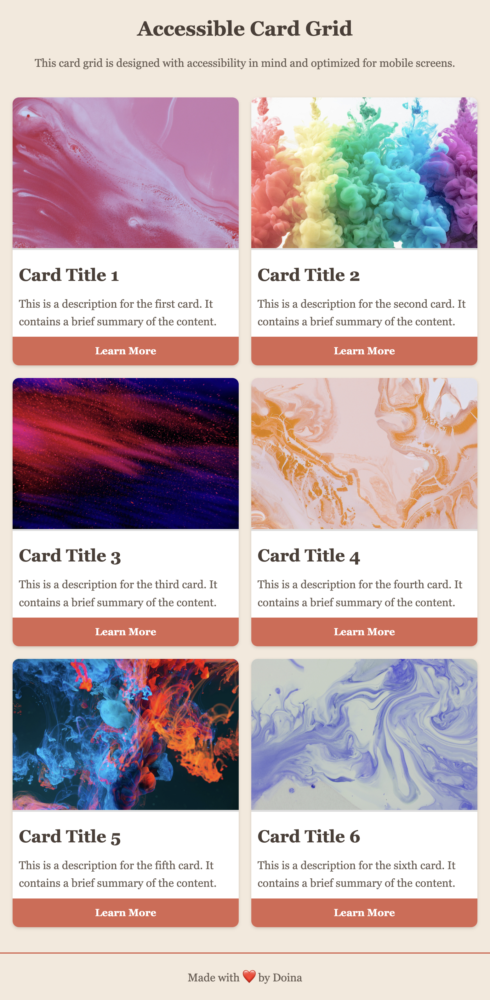

# Accessible Card Grid

## Table of Contents

- [Accessible Card Grid](#accessible-card-grid)
  - [Table of Contents](#table-of-contents)
  - [Overview](#overview)
    - [The challenge](#the-challenge)
    - [Screenshots](#screenshots)
    - [Links](#links)
  - [My process](#my-process)
    - [Built with](#built-with)
    - [What I learned](#what-i-learned)
    - [Continued Development](#continued-development)
    - [Useful Resources](#useful-resources)

## Overview

### The challenge

The goal of this project was to build an accessible card grid that is both responsive and user-friendly, featuring abstract images. The cards include smooth hover effects, keyboard navigation support, and are fully accessible for all users, ensuring a seamless experience on both desktop and mobile devices.

### Screenshots

| Device      | State        | Screenshot                                                                              |
| ----------- | ------------ | --------------------------------------------------------------------------------------- |
| **Mobile**  | Default      |          |
| **Tablet**  | Default      |  |
|             | Hover Effect |   |
| **Desktop** | Default      |        |

### Links

- [Live Demo](https://doileo.github.io/accessible-card-grid/)
- [GitHub Repository](https://github.com/Doileo/accessible-card-grid)

## My process

### Built with

- HTML5 for semantic structure
- CSS3 with Flexbox and Grid for responsive design

### What I learned

- Creating an accessible card grid layout with keyboard and screen reader support.
- Implementing responsive design for mobile, tablet, and desktop using CSS Grid.
- Adding hover effects for better interactivity and user experience on larger screens.

### Continued Development

Future updates could include:

- Implementing lazy loading for images to improve performance.
- Adding more detailed animations for hover and focus states.
- Further optimizing the grid layout for even more screen sizes and orientations.

### Useful Resources

- [CSS Grid Layout](https://developer.mozilla.org/en-US/docs/Web/CSS/CSS_Grid_Layout)
- [WAI-ARIA Overview](https://www.w3.org/WAI/standards-guidelines/aria/)
- [Hover and Focus in CSS](https://css-tricks.com/almanac/selectors/h/hover-focus/)
